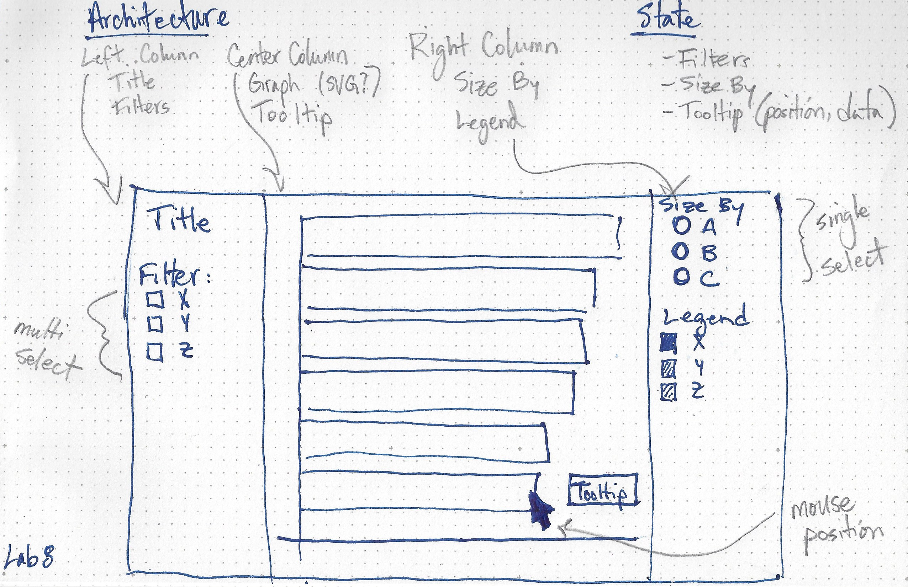

## Lab 8: Interactivity

This lab demonstrates filter, select, and hover behavior with a D3 visualization. This also shows how to use a `state` variable to keep track of your data.

### App Architecture + State Schema

### Activity 1: Pseudo code

- Let's look at the final result
- Let's write pseudo code. What actually has to happen here?
- Let's turn that into functions
- What are the states the visualization?

### Activity 2: Code analysis

- First get an overview of everything
- Do a close read of each function
  - What is contained in the state object?
  - When and how often are these functions called: dataLoad(), onCheckboxChange(), onMouseEvent(), initializeLayout(), draw()
- Describe to the class

### JS Resources

- Array.map() https://developer.mozilla.org/en-US/docs/Web/JavaScript/Reference/Global_Objects/Array/map
- Async Await https://developer.mozilla.org/en-US/docs/Learn/JavaScript/Asynchronous/Async_await
- Array.slice() https://developer.mozilla.org/en-US/docs/Web/JavaScript/Reference/Global_Objects/Array/slice
- Spreader https://developer.mozilla.org/en-US/docs/Web/JavaScript/Reference/Operators/Spread_syntax
